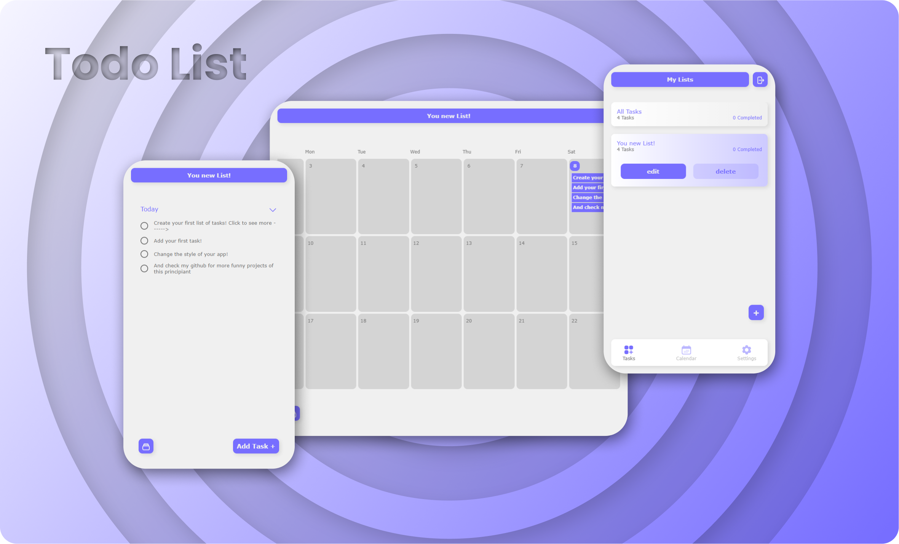
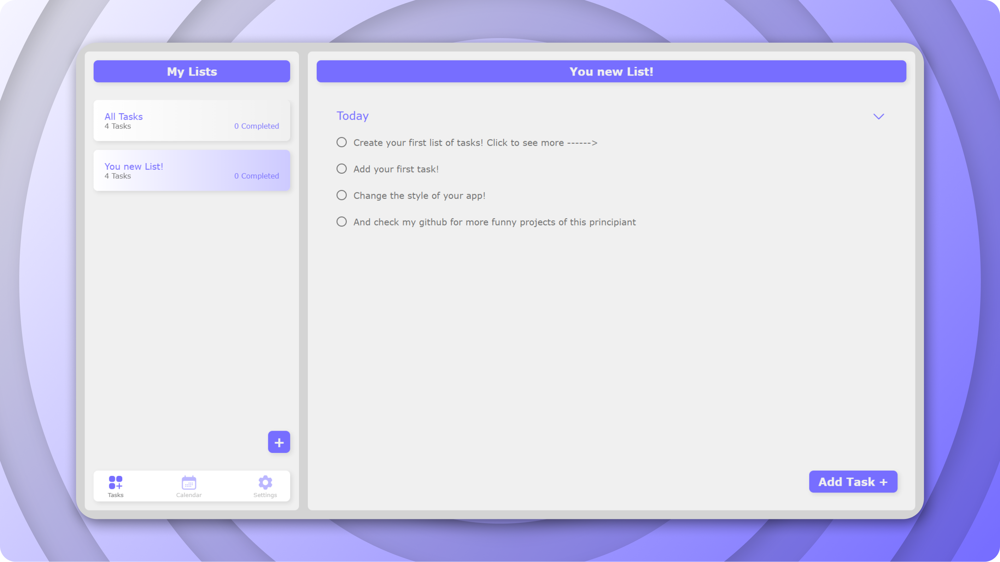

#

<h1 align="center">Todo list</h1>

  Todo list for <a href="https://www.theodinproject.com/">The Odin Project</a>

## Demo

👁️ [Live Demo](https://apheiro.github.io/todo_list/)

## Built with

- JavaScript
- Css
- Webpack
- [anime.js](https://apheiro.github.io/todo_list/)
- [flatted](https://github.com/WebReflection/flatted)
- [auto-animate](https://github.com/formkit/auto-animate)
- [TOASTUI Calendar](https://github.com/nhn/tui.calendar)
- [date-fns](https://github.com/date-fns/date-fns)

## Features

- Dinamic HTML
- Responsive design.
- Clean desing
- _Smooth_ animations.
- Different styles.

## Screenshots

